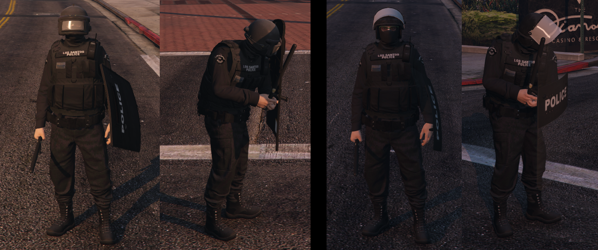

# Altv Police Shields



## Features

This ressource adds a useable ballistic & riot shield. They
- Block bullets
- Can be used with a nightstick as sidearm

## Usage

To equip a ballistic shield emit the following **serverside**: 

```alt.emit("Server:Shield:giveShield", client, true)```

To equip a riot shield emit the following **serverside**:

```alt.emit("Server:Shield:giveShield", client, false)```

To unequip any shield emit the following **serverside**:

```alt.emit("Server:Shield:removeShield", client)```

## Test setup

If you just want to test the ressource add the following

to the **client.js**:

```
alt.on('keydown', (key) => {
    if (key === "L".charCodeAt(0)) {
        alt.emitServer("Server:Shield:Test");
    }
});
```

to the **index.mjs**:

```
alt.onClient("Debug", (client) => {
    if(client.hasStreamSyncedMeta("shield")){
        alt.emit("Server:Shield:removeShield", client);
    }else{
        alt.emit("Server:Shield:giveShield", client, false);
    }
})
```

With that anyone can (un)equip the shield by pressing "L"
